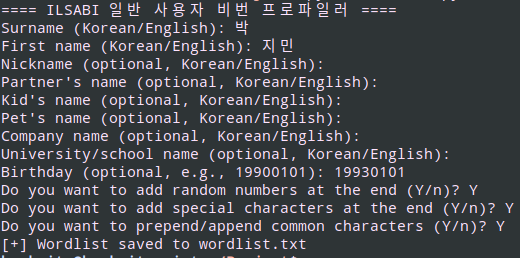

# ILSABI (일반 사용자 비밀번호 프로파일러)

ILSABI is based on CUPP (Common User Passwords Profiler). CUPP is a tool that helps find weak and easily guessed passwords, but it falls short when it comes to profiling common Korean passwords.

Weak passwords in Korea are just as easily profiled as English passwords. Other than common ones like `password123` and `qwerty123`, many Korean passwords are variations of names, pets, or other personal information. Names are usually typed in Korean but registered using their corresponding Roman characters.

For example:  
박지민 = qkrwlals

## Features

* Generates wordlists with Romanized Korean names.
* Includes versions of names typed on an English keyboard (e.g., 박지민 becomes `qkrwlals`).
* Adds variations with numbers, special characters, and common patterns.
* Supports names, nicknames, birthdays, company names, pet names, and more.

### Prerequisites

* Python 3

### Usage

1. Run the script using Python:  
   `python3 ilsabi.py`
2. Follow the prompts to enter the required information (e.g., name, nickname, birthday).
3. The generated wordlist will be saved in the same directory.

## Author

[booknite]

Originally created by Muris Kurgas aka j0rgan  
[j0rgan@remote-exploit.org](mailto:j0rgan@remote-exploit.org)  
[http://www.remote-exploit.org](http://www.remote-exploit.org)  
[http://www.azuzi.me](http://www.azuzi.me)

And the CUPP Contributors

* Bosko Petrovic aka bolexxx  
  [bole_loser@hotmail.com](mailto:bole_loser@hotmail.com)  
  [http://www.offensive-security.com](http://www.offensive-security.com)  
  [http://www.bolexxx.net](http://www.bolexxx.net)
* Mebus  
  [https://github.com/Mebus/](https://github.com/Mebus/)
* Abhro  
  [https://github.com/Abhro/](https://github.com/Abhro/)
* Andrea Giacomo  
  [https://github.com/codepr](https://github.com/codepr)
* quantumcore  
  [https://github.com/quantumcore](https://github.com/quantumcore)

## License

This project is free to use, edit, or revise any way you like.

## Note

I plan to add more features, such as integrating wordlist repositories and improving name parsing. For example, the current version changes the surname `이` to `I`, but future updates will include options like `Lee`, `Rhee`, and `Yi`.
